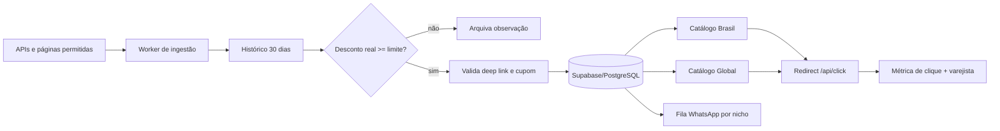

# Arquitetura do Radar de Ofertas

## Resultado proposto

O projeto separa coleta, decisão comercial, publicação e distribuição. O catálogo nunca publica uma URL sem rastreamento válido: Amazon recebe a `tag` no backend; Mercado Livre, iHerb e redes equivalentes exigem um deep link oficial previamente gerado ou obtido pela API autorizada da conta.

## Stack recomendada

| Camada | Escolha | Motivo |
|---|---|---|
| Catálogos | React 19 + Vinext/Next API + Tailwind | UI rápida, responsiva, SSR e rotas `/brasil` e `/global` |
| Banco principal | Supabase/PostgreSQL 16 | histórico temporal, índices, RLS, API REST e operação simples |
| Automação | Node.js 22 | `fetch` nativo, mesma linguagem do frontend e execução barata em CI/worker |
| Agenda | GitHub Actions, cron `17 */6 * * *` | ciclo de 6 horas, execução manual e logs; em escala, migrar para Cloudflare Cron/Temporal |
| WhatsApp | Meta Cloud API como padrão; Evolution opcional | caminho oficial primeiro, adaptador alternativo isolado |
| Links | Redirect interno `/api/click/:slug` | valida tag, registra CTR e impede link não monetizado |
| Observabilidade | logs JSON + tabela de disparos | auditoria por ciclo, produto e canal |

## Fluxo de dados

1. `automation/src/run-cycle.mjs` lê fontes autorizadas.
2. `ingestion.mjs` aplica timeout, repetição com backoff, respeito a `Retry-After` e baixa concorrência.
3. O parser prioriza JSON-LD. Para produção, cada varejista deve usar sua API de afiliados quando disponível; scraping deve respeitar termos e `robots.txt`.
4. O preço atual é comparado à média aparada das observações válidas dos últimos 30 dias. Com menos de três pontos, a oferta não é aprovada.
5. `affiliate-links.mjs` remove UTMs e tags de terceiros, injeta as tags Amazon e exige deep link oficial para as demais redes.
6. Apenas ofertas aprovadas são persistidas. O catálogo lê somente registros ativos com `url_afiliado`.
7. O redirecionador grava o clique com hash do IP, sem armazenar o IP bruto.
8. `distribution.mjs` cruza categoria, subcategoria, região e visibilidade do canal; depois envia com limitação de taxa e deduplicação pela tabela `disparos_whatsapp`.

## Isolamento dos canais

- `AUTOMOTIVO / ANTIGOS_COLECIONAVEIS`
- `AUTOMOTIVO / POPULARES_MANUTENCAO`
- `AUTOMOTIVO / PREMIUM_LUXO`
- `SUPLEMENTACAO_LONGEVIDADE / PERFORMANCE_HIPERTROFIA`
- `SUPLEMENTACAO_LONGEVIDADE / LONGEVIDADE_ESTETICA_SKINCARE`

Cada grupo recebe apenas ofertas com a mesma região, categoria e subcategoria. Para Mercado Livre, o dispatcher bloqueia canais marcados como privados.

## Segurança e operação

- `SUPABASE_SERVICE_ROLE_KEY`, tokens do WhatsApp e chaves de APIs ficam somente em secrets do servidor.
- O frontend nunca recebe credenciais de escrita.
- O redirecionamento aceita somente HTTPS e ofertas conhecidas.
- Publicação é bloqueada quando o link afiliado não pode ser validado.
- O sistema não tenta contornar CAPTCHA. Ao encontrar proteção, registra falha e migra a fonte para API/parceria autorizada.
- Mensagens incluem identificação de publicidade e devem usar templates aprovados quando a Meta exigir.

## Regras de programa que afetam o desenho

- A Amazon informa que a ID de rastreamento aparece normalmente no parâmetro `tag`; o projeto valida esse valor antes de publicar.
- O Mercado Livre orienta gerar links pelo Portal/Barra de Afiliados e restringe certas páginas e grupos privados; por isso o ID do perfil não é tratado como parâmetro universal de link.
- A iHerb orienta usar o link/código personalizado do painel. Antes de ativar o catálogo de ofertas, confirme por escrito que a modalidade de afiliado contratada permite esse canal.

Fontes oficiais: [Amazon Associados — verificação de links](https://associados.amazon.com.br/help/node/topic/G6253GFSARDQENZR), [Mercado Livre — geração de links](https://www.mercadolivre.com.br/l/afiliados-gere-seus-links), [Mercado Livre — páginas não permitidas](https://www.mercadolivre.com.br/l/afiliados-paginas-nao-permitidas), [Mercado Livre — checklist de canais](https://www.mercadolivre.com.br/l/checklist), [iHerb — programas de afiliados](https://information.iherb.com/hc/en-us/articles/8865006773140-About-the-iHerb-Affiliate-Influencer-Programs).

## Produção

1. Execute `database/schema.sql` no Supabase.
2. Copie `.env.example` para `.env.local` e preencha apenas no seu computador/host.
3. Copie `automation/config/sources.example.json` para `sources.json` e informe URLs reais, IDs, slugs e deep links oficiais.
4. Cadastre os grupos em `canais_whatsapp`, classificando cada um por nicho e visibilidade.
5. Adicione os secrets ao executor agendado e rode primeiro via `workflow_dispatch`.
6. Confira links com as ferramentas de validação de cada programa antes do primeiro disparo.
